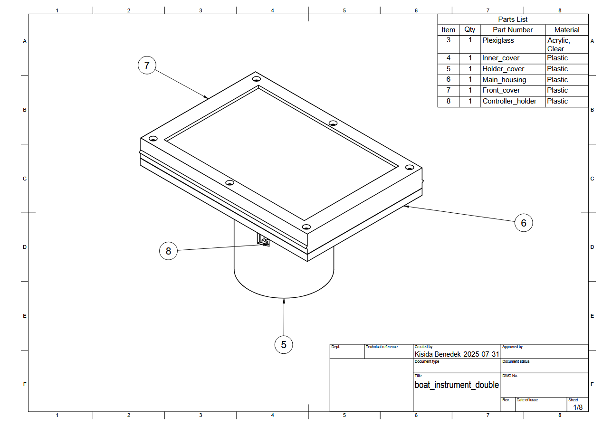

 

  <picture>
    <source media="(prefers-color-scheme: dark)" srcset="./documentation/logo_dark.png">
    
  </picture>
  <h2 align="center">ESP32 Boat Instrument</h2>

## ESPSkipper

ESP32 based, open source, low cost boat instrumentation to replace proprietary marine systems.

## Features

- GPS based speed display
- Dynamic multi-function display showing real-time metrics
- Dual display system showing data independently
- Using ST7920 128x64 transflective displays for good outdoors visibility 
- Multi language support
- Configuration through WIFI
- Open Echo integration, supports depth readings from the TUSS4470 shield through serial connection
- Rugged weather-resistant housing
- Reading water temp thermistors from analog transducers

## Tech Stack

**ESP32:** C++, U8g2lib, PlatformIO, Arduino Platform, HTML, 

## Screenshots

## Hardware Components

The bold text items are required for the project, non bold components are optional.

| Component                   | Description                                         | Link                           |
|-----------------------------|-----------------------------------------------------|--------------------------------|
| **1x ESP32 Devkit V4**         | Main microcontroller handling display, GPS, and Open Echo data | [ESP32 Devkit V4](https://www.aliexpress.com/item/1005006422498371.html) |
| **1x GPS Module (e.g. NEO‑6M/NEO-8M)**| Location, Speed, Course data via NMEA        | [NEO-6M](https://www.aliexpress.com/item/1005007175919889.html) |
| **2x ST7920 128x64 Display**  | Good visibility transflective LCD with backlight | [ST7920 12864](https://www.aliexpress.com/item/2043862354.html) |
| **1x pushbutton** | Can be any pushbutton, but the housing is designed for this type | [10Pcs 7mm Threaded button](https://www.aliexpress.com/item/32804945328.html) |
| **15x4mm EPDM sponge crown strip** | Needed for sealing (you can experiment with similar types too) | [15x4 EPDM strip](https://www.sealsdirect.co.uk/shop/srs3293-22832) |
| **2mm thick plexiglass** | Cut for 160x110mm | - |
| Arduino UNO R3      | Needed for the open_echo project   | [UNO R3](https://www.aliexpress.com/item/1005006141687578.html) |
| TUSS4470 Shield    | Needed for the open_echo project. Order it through **JLCPCB**         | [TUSS4470 shield](https://github.com/Neumi/open_echo/tree/main/TUSS4470_shield_002/TUSS4470_shield_hardware/TUSS4470_shield) |
| MT3608 step-up converter  | Suggested for the open_echo project to get 24V           | [MT3608](https://www.aliexpress.com/item/1005007508800676.html) |
| LM2596s step-down converter    | Needed if you are powering the ESP32 from a battery | [LM2596s](https://www.aliexpress.com/item/33004374185.html) |
| 470uF< capacitor (35V) | Needed for voltage stability before TUSS4470 | - |
| 1x 10k Ohm resistor    | Needed for the UNO-ESP serial | - |
| 1x 20k Ohm resistor    | Needed for the UNO-ESP serial | - |
| IRL540N N-MOSFET Transistor | Needed for toggling the display backlight | - |
| **Cables & Connectors**     | Some cables, and jumper wires for connections                  | - |

  

## Acknowledgements

 - [Open Echo](https://github.com/Neumi/open_echo)

